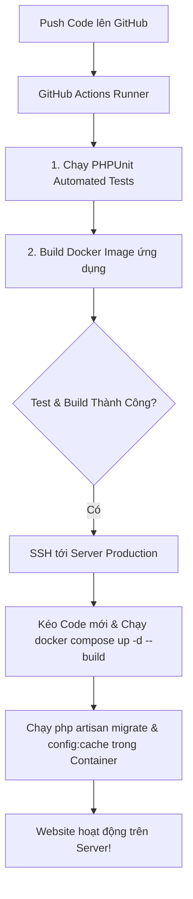

# 🚀 Hướng Dẫn Kích Hoạt & Vận Hành CI/CD & Docker (Quán Mới System)

Tài liệu này chứa toàn bộ cấu hình mẫu và hướng dẫn cài đặt quy trình tự động hóa **CI/CD** và **Docker Containers** cho trang web của bạn. Tất cả các file đều được lưu độc lập trong thư mục `demo-cicd/`.

---

## 🐳 1. Các File Docker Mới Tạo Trong Thư Mục `demo-cicd/`

| Đường dẫn File | Chức năng | Hướng dẫn sử dụng |
| :--- | :--- | :--- |
| [`demo-cicd/docker/Dockerfile`](file:///d:/quanmoi.com/demo-cicd/docker/Dockerfile) | **Dockerfile Multi-Stage** | Biên dịch Frontend (Node 20/Vite) & đóng gói Laravel vào PHP 8.3-FPM. |
| [`demo-cicd/docker/nginx.conf`](file:///d:/quanmoi.com/demo-cicd/docker/nginx.conf) | **Cấu hình Nginx** | Đuôi cấu hình web server Nginx điều hướng request tới PHP-FPM container. |
| [`demo-cicd/docker-compose.yml`](file:///d:/quanmoi.com/demo-cicd/docker-compose.yml) | **Docker Compose Orchestration** | Quản lý 3 containers liên kết: `quanmoi_app` (PHP), `quanmoi_nginx` (Web), `quanmoi_db` (MySQL 8). |
| [`demo-cicd/docker-deploy-workflow.yml`](file:///d:/quanmoi.com/demo-cicd/docker-deploy-workflow.yml) | **GitHub Actions Docker CI/CD** | Workflow tự động chạy test, build Docker Image và deploy container lên Server. |

---

## 🛠 2. Hướng Dẫn Chạy Docker Trên Máy Local (Hoặc Server)

Nếu máy tính (hoặc Server) của bạn đã cài **Docker Desktop** (hoặc Docker Engine), bạn có thể bật toàn bộ hệ thống (PHP + Nginx + MySQL) bằng 1 lệnh duy nhất:

### Bước 1: Khởi tạo Docker Container
```bash
docker compose -f demo-cicd/docker-compose.yml up -d --build
```

### Bước 2: Chạy Migration và Optimize Laravel bên trong Container
```bash
docker exec quanmoi_app php artisan key:generate
docker exec quanmoi_app php artisan migrate --force
docker exec quanmoi_app php artisan config:cache
```

### Bước 3: Truy cập trang web
- Mở trình duyệt và truy cập: **`http://localhost`**
- Nginx container sẽ tự động bắt request ở cổng `80` và chuyển xử lý tới Laravel PHP-FPM container.

---

## 🔄 3. Mô Hình Tự Động Hóa Docker + CI/CD Trên Server



---

## 💻 4. Hướng Dẫn Chạy Test CI/CD Trên Máy Local (Không cần Docker)

| Hệ điều hành | Câu lệnh chạy thử |
| :--- | :--- |
| **Windows (CMD / PowerShell)** | `demo-cicd\run-local-ci.bat` |
| **Linux / macOS / Git Bash** | `bash demo-cicd/run-local-ci.sh` |
| **Git Hook Tự động** | Copy [`demo-cicd/git-hook-pre-push.sh`](file:///d:/quanmoi.com/demo-cicd/git-hook-pre-push.sh) vào `.git/hooks/pre-push` |
